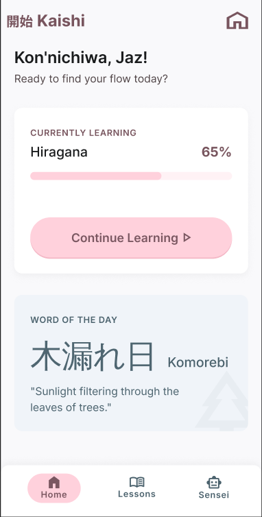
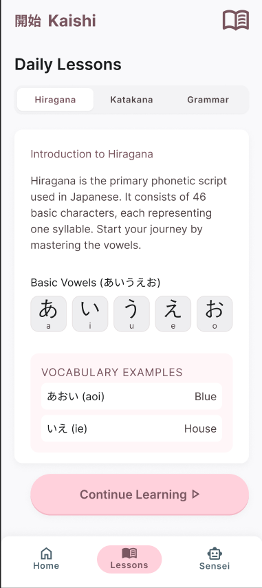
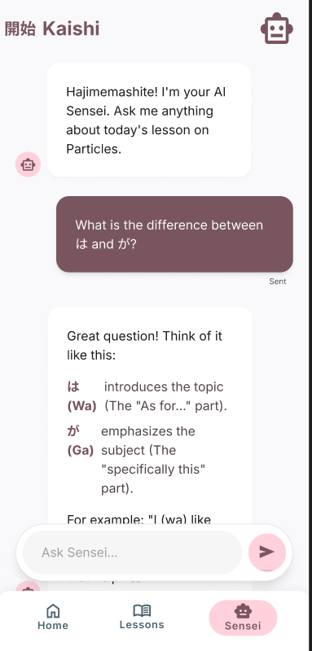
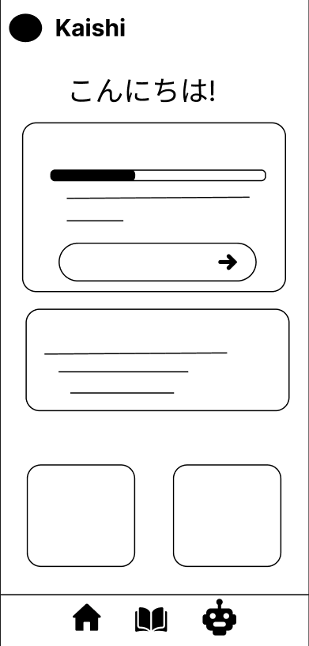
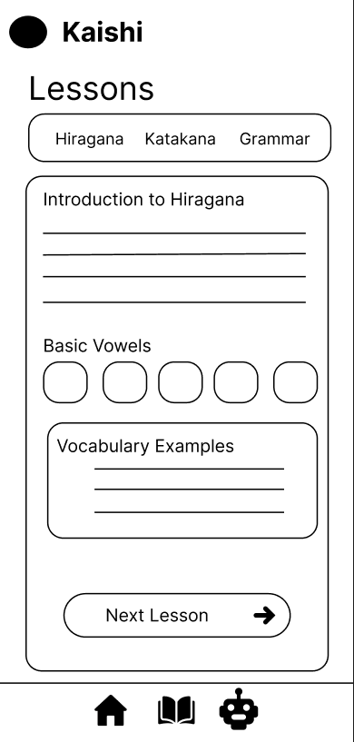
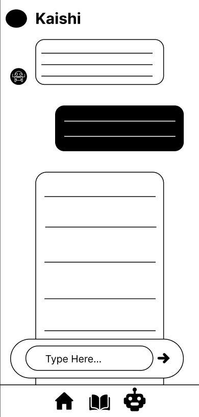

# Mockup and wireframes

## Mockup 
###1. Home Screen

**What the user does here:** Sees a greeting, checks progress on the course they are currently learning, resumes that course, and reads the Word of the Day.
**Where each tappable thing goes:**
- **Continue Learning Button:** Opens the Lessons screen at the user's current lesson.
- **Bottom Navigation Bar (Home | Lessons | Sensei):** Switches between the three main screens. The current screen is highlighted.

### 2.Lessons Screen

**What the user does here:**Picks between Hiragana, Katakana and Grammar. reads the current lesson, studies the basic characters and vocabulary examples, and moves on to the next lesson.

**Where each tappable thing goes:**
- **Category Tabs (Hiragana | Katakana | Grammar):** Switches the lesson content to the selected category.
- **Next Lesson → Button:**Loads the next lesson in the same category.
- **Bottom Navigation Bar (Home | Lessons | Sensei):** Switches between the three main screens. The current screen is highlighted.

### 3. Sensei (AI Chat) Screen

**What the user does here:** Asks the AI tutor questions about the day's lesson and reads its explanations in a chat thread.

**Where each tappable thing goes:**
- **Ask Sensei... Input::** Tapping activates text entry for a question.
- **Bottom Navigation Bar (Home | Lessons | Sensei):** Switches between the three main screens. The current screen is highlighted.

## Wireframes

###1. Home Screen
| Screen | Layout Notes | Inputs | Actions → Destination | Data Shown |
|--------|--------------|--------|-----------------------|------------|
| Home |Displays the app logo and name, a Japanese greeting, a progress card with a progress bar and arrow button, a Word of the Day card, two placeholders, and a bottom navigation bar. | None | Arrow Button → Lessons
Nav Bar → Home, Lessons, or Sensei| Current course progress, Word of the Day|

###2. Lesson Screen

| Screen | Layout Notes | Inputs | Actions → Destination | Data Shown |
|--------|--------------|--------|-----------------------|------------|
| Lessons |Displays the “Lessons” title, three category tabs, a lesson card with intro text, five character tiles, a Vocabulary Examples box, and a Next Lesson button. | None | Tab → Lesson content for that category, Next Lesson → Next lesson, Nav Bar → Home, Lessons, or Sensei | Lesson for Hiragana, Katakana and Basic Grammar with examples |

###3.Sensei (AI Chat)

| Screen | Layout Notes | Inputs | Actions → Destination | Data Shown |
|--------|--------------|--------|-----------------------|------------|
| AI Chat |Displays a chat thread with Sensei and user messages, plus a text input with a send button above the bottom navigation bar. | Chat message text | Send → Adds message to thread and shows Sensei's reply
Nav Bar → Home, Lessons, or Sensei | Conversation history|

## Screens
### 1. Home Screen
**What is on it:**
- Kaishi logo and app name in the header
- Word of the Day card with the Japanese word, romanization, and meaning
- password visibility toggle
- Continue Learning action
- bottom navigation bar (Home, Lessons, Sensei)

**What the user does:**

The user checks how far along they are in the current course, jumps back into it, or reads the daily word. Home is the first screen the app opens on.

**Where each action goes:**

| Action | Result |
| --- | --- |
| Continue Learnings | 	Lessons screen at the current lesson|
| Nav bar: Lessons | Lessons screen |
| Nav bar: Sensei | 	Ai screen |

The Word of the Day card is display only; it does not lead anywhere.

### 2. Lesson Screen
**What is on it:**
- Kaishi logo and app name in the header
- category tabs (Hiragana / Katakana / Grammar)
- Next Lesson action
- bottom navigation bar (Home, Lessons, Sensei)

**What the user does:**

The user chooses a lessons between Hiragana, Katakana and Grammar. reads the lesson, studies each character and the vocabulary examples, then continues to the next lesson.

**Where each action goes:**

| Action | Result |
| --- | --- |
| Category tab | 		Changes the lesson content to the selected category|
| Next Lesson | 	Next lesson in the same category|
| Nav bar: Home | Home screen |
| Nav bar: Sensei | Sensei screen |

### 3.

**What is on it:**
- Kaishi logo and app name in the header
- "Ask Sensei..." input field with a send button
- Sensei replies with formatted explanations and examples
- bottom navigation bar (Home, Lessons, Sensei)

**What the user does:**

The user asks a question about what they are learning.

**Where each action goes:**

| Action | Result |
| --- | --- |
| Ask Sensei... input | Activates text entry |
| Send | 	Adds the question to the thread; Sensei's reply appears below it |
| Nav bar: Home | Home screen |
| Nav bar: Lessons | Lessons screen |
